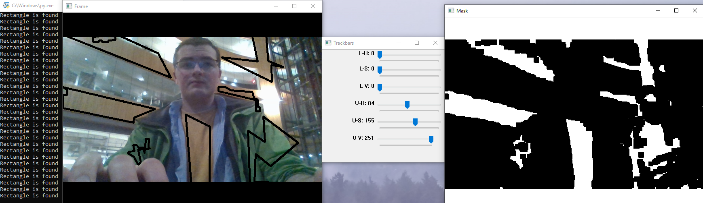
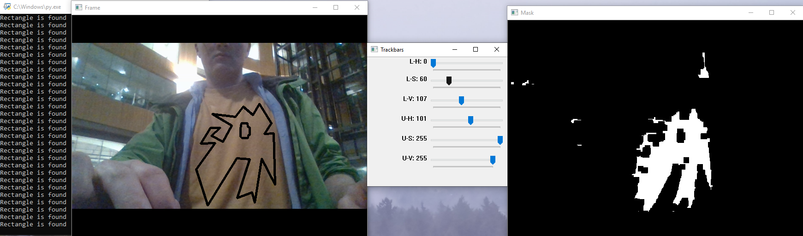

# OpenCVDetection
Experimentation with different opencv libraries 

## User Guide
This program creates 3 windows 
One displays an image from your webcam. 
One shows what pixels are still being registered. 
The final window has a set of sliders. 
Moving the sliders around affects the other windows real time. 
Finally if a rectangle is recognized on the screeen it will print to your console. 

## Skills learned
This coding adventure taught me a little bit about openCV libraries. 
Ultimately my goal was to securely recognize a rectangle on the screen. 
While it technically does so, I was dissapointed with the effectiveness. 
I did manage to match specific colors, and often could recognize a rectangle 
if the object had a distinct color. 

I am excited to see what else I can do with image processing. 
